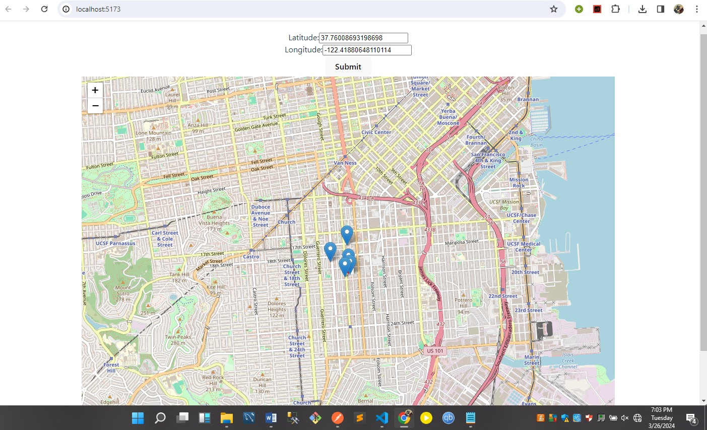

# 🚀 RAKT's "Out-of-the-Box" Engineering Challenge 🌟

## Introduction

Welcome to RAKT take home assignment, this an api endpoint given a coordinate in San Francisco return five of the nearest food trucks

### Local Development Setup

1. **Clone the repository:**

   ```bash
   git clone https://github.com/Simon-Ghiwot/RAKT-take-home-assignment.git
   cd RAKT-take-home-assignment
   ```

2. **Create a virtual environment and install dependencies:**

   ```bash
   python -m venv venv
   venv/bin/activate.bat  # On Windows: .\venv\Scripts\activate
   pip install -r requirements.txt
   ```

3. **Apply migrations:**

   ```bash
   python manage.py migrate
   ```

4. **Run the development server:**

   ```bash
   python manage.py runserver
   ```

### How to Use the API (Demonstration)

1. **URL :**

   ```bash
       POST http://127.0.0.1:8000/foodtrucks/
   ```

2. **Pay load:**
   ```bash
        payload = {
            "origin_latitude" : "37.76008693198698",
            "origin_longtiude" : "-122.41880648110114"
        }
   ```
3. **Sample Output**
   ```bash
       {
           "data": [
               {
                   "distance": 0.0,
                   "food_truck": {
                       "id": 1,
                       "location_id": 1728067,
                       "applicant": "Leo's Hot Dogs",
                       "facility_type": "Push Cart",
                       "cnn": 9121000,
                       "location_description": "MISSION ST: 19TH ST to 20TH ST (2300 - 2399)",
                       "address": "2301 MISSION ST",
                       "block_lot": "3595031",
                       "block": "3595",
                       "lot": "031",
                       "permit": "23MFF-00008",
                       "status": "APPROVED",
                       "food_items": "Hot dogs and related toppings: non alcoholic beverages",
                       "x": 6007018.02,
                       "y": 2104913.057,
                       "latitude": 37.76008693198698,
                       "longitude": -122.41880648110114,
                       "schedule": "http://bsm.sfdpw.org/PermitsTracker/reports/report.aspx?title=schedule&report=rptSchedule&params=permit=23MFF-00008&ExportPDF=1&Filename=23MFF-00008_schedule.pdf",
                       "days_hours": "",
                       "approved": null,
                       "received": "2023-09-20T00:00:00Z",
                       "prior_permit": 1,
                       "expiration_date": null,
                       "fire_prevention_districts": 2,
                       "police_districts": 4,
                       "supervisor_districts": 7,
                       "zip_codes": 28859,
                       "neighborhoods": "19"
                   }
               },
               {
                   "distance": 0.09692580439253798,
                   "food_truck": {
                       "id": 201,
                       "location_id": 1163405,
                       "applicant": "Julie's Hot Dogs",
                       "facility_type": "Truck",
                       "cnn": 9121000,
                       "location_description": "MISSION ST: 19TH ST to 20TH ST (2300 - 2399)",
                       "address": "2365 MISSION ST",
                       "block_lot": "3595024",
                       "block": "3595",
                       "lot": "024",
                       "permit": "17MFF-0190",
                       "status": "EXPIRED",
                       "food_items": "Hot dogs: Bacon wrapped hot dogs: soda: water: sports drinks: energy drinks: chips",
                       "x": 6007087.513,
                       "y": 2104603.286,
                       "latitude": 37.75924028515023,
                       "longitude": -122.4185441711166,
                       "schedule": "http://bsm.sfdpw.org/PermitsTracker/reports/report.aspx?title=schedule&report=rptSchedule&params=permit=17MFF-0190&ExportPDF=1&Filename=17MFF-0190_schedule.pdf",
                       "days_hours": "Su/Fr/Sa:12AM-3AM;Th/Fr/Sa:10PM-12AM",
                       "approved": null,
                       "received": "2017-08-24T00:00:00Z",
                       "prior_permit": 0,
                       "expiration_date": null,
                       "fire_prevention_districts": 2,
                       "police_districts": 4,
                       "supervisor_districts": 7,
                       "zip_codes": 28859,
                       "neighborhoods": "19"
                   }
               },
               {
                   "distance": 0.1433388575822166,
                   "food_truck": {
                       "id": 294,
                       "location_id": 1010174,
                       "applicant": "Julie's Hot Dogs",
                       "facility_type": "Truck",
                       "cnn": 9121000,
                       "location_description": "MISSION ST: 19TH ST to 20TH ST (2300 - 2399)",
                       "address": "2386 MISSION ST",
                       "block_lot": "3596119",
                       "block": "3596",
                       "lot": "119",
                       "permit": "15MFF-0007",
                       "status": "REQUESTED",
                       "food_items": "Hot dogs: bacon-wrapped hot dogs: chicken burgers: energy drinks: water and various other drinks.",
                       "x": 6006843.48,
                       "y": 2104477.073,
                       "latitude": 37.75887999201479,
                       "longitude": -122.41937920298372,
                       "schedule": "http://bsm.sfdpw.org/PermitsTracker/reports/report.aspx?title=schedule&report=rptSchedule&params=permit=15MFF-0007&ExportPDF=1&Filename=15MFF-0007_schedule.pdf",
                       "days_hours": "Tu/We/Th:12AM-3AM;Mo-We:12PM-12AM",
                       "approved": null,
                       "received": "2015-02-23T00:00:00Z",
                       "prior_permit": 0,
                       "expiration_date": null,
                       "fire_prevention_districts": 2,
                       "police_districts": 4,
                       "supervisor_districts": 7,
                       "zip_codes": 28859,
                       "neighborhoods": "19"
                   }
               },
               {
                   "distance": 0.28237955377643204,
                   "food_truck": {
                       "id": 191,
                       "location_id": 1163784,
                       "applicant": "SOHOMEI, LLC",
                       "facility_type": "Truck",
                       "cnn": 13064000,
                       "location_description": "VALENCIA ST: 18TH ST to 19TH ST (700 - 799)",
                       "address": "740 VALENCIA ST",
                       "block_lot": "3588006",
                       "block": "3588",
                       "lot": "006",
                       "permit": "18MFF-0028",
                       "status": "REQUESTED",
                       "food_items": "COLD TRUCK. Deli: bbq chicken skewer: Chinese spring roll: Chinese fried rice/noodle: fried chicken leg/wing: bbq chicken sandwich: chicken cheese burger: burrito: lumpia. Snack: sunflower seeds: muffins: chips: snickers: kit-kat: 10 types of chocolate. Drinks: Coke: 7-Up: Dr. Pepper: Pepsi: Redbull: Vitamin Water: Rockstar: Coconut Juice: Water. Hot drinks: coffee: tea.",
                       "x": 6006152.35,
                       "y": 2105247.76,
                       "latitude": 37.760957168278544,
                       "longitude": -122.42182419935827,
                       "schedule": "http://bsm.sfdpw.org/PermitsTracker/reports/report.aspx?title=schedule&report=rptSchedule&params=permit=18MFF-0028&ExportPDF=1&Filename=18MFF-0028_schedule.pdf",
                       "days_hours": "Mo-Fr:11AM-12PM",
                       "approved": null,
                       "received": "2018-05-21T00:00:00Z",
                       "prior_permit": 1,
                       "expiration_date": null,
                       "fire_prevention_districts": 2,
                       "police_districts": 4,
                       "supervisor_districts": 5,
                       "zip_codes": 28859,
                       "neighborhoods": "19"
                   }
               },
               {
                   "distance": 0.3437987978489874,
                   "food_truck": {
                       "id": 186,
                       "location_id": 1039786,
                       "applicant": "Julie's Hot Dogs",
                       "facility_type": "",
                       "cnn": 9117000,
                       "location_description": "MISSION ST: 17TH ST to CLARION ALY (2100 - 2131)",
                       "address": "2101 MISSION ST",
                       "block_lot": "3575091",
                       "block": "3575",
                       "lot": "091",
                       "permit": "17MFF-0196",
                       "status": "REQUESTED",
                       "food_items": "Hot dogs: bacon wrap hot dogs: chicken burgers: energy drinks: water & various drinks",
                       "x": 6006982.392,
                       "y": 2106038.314,
                       "latitude": 37.76317461963382,
                       "longitude": -122.41900951477052,
                       "schedule": "http://bsm.sfdpw.org/PermitsTracker/reports/report.aspx?title=schedule&report=rptSchedule&params=permit=17MFF-0196&ExportPDF=1&Filename=17MFF-0196_schedule.pdf",
                       "days_hours": "Tu/We/Th:10AM-8PM",
                       "approved": null,
                       "received": "2017-10-27T00:00:00Z",
                       "prior_permit": 0,
                       "expiration_date": null,
                       "fire_prevention_districts": 8,
                       "police_districts": 4,
                       "supervisor_districts": 7,
                       "zip_codes": 28859,
                       "neighborhoods": "19"
                   }
               }
           ]
       }
   ```

## Trade off

This project demonstrates the implementation of the Haversine distance formula for calculating proximity between two geographical coordinates. The Haversine formula is commonly used to calculate the distance between two points on a sphere, such as the Earth. This could have been done on the database by using proximity calculators but I wanted to use this equation because it would be a great learning exprience. The database implmentation would slightly be faster than the actual Haversine calculation.

## Sample



## License

The Assignment is a take home assignment from RAKT Technologies. Author : Simon G/hiwot.

## Contact

To Contact me use @simonghiwot17@gmail.com.
